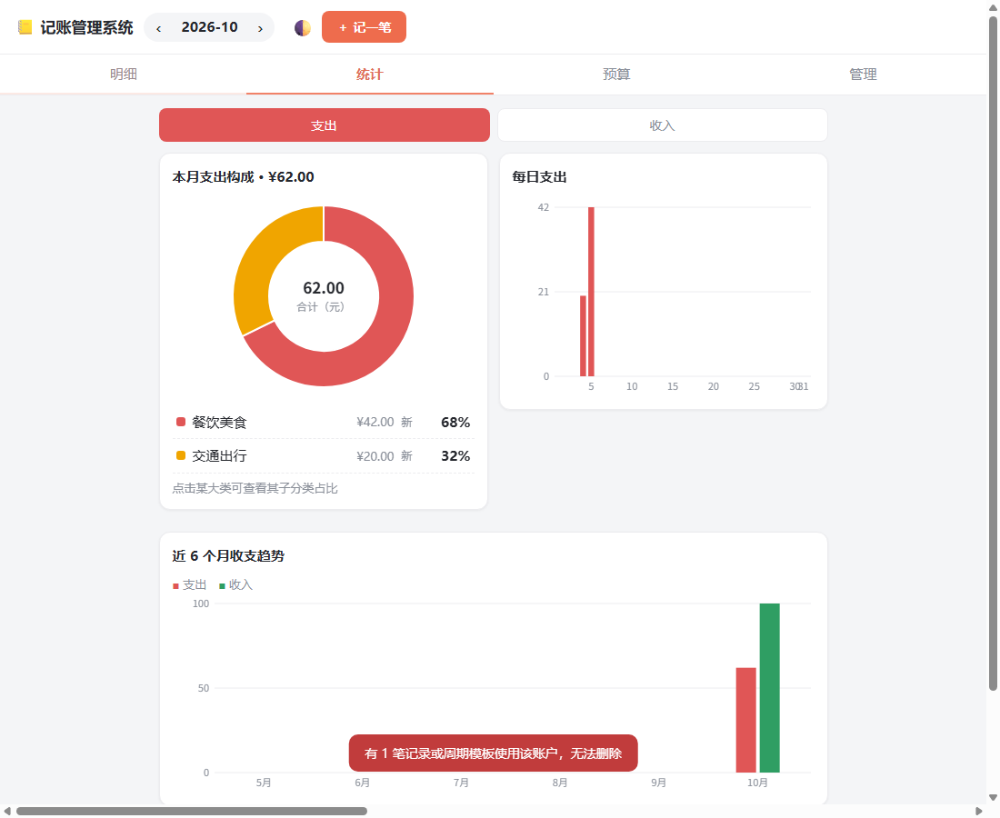

# 记账管理系统

[](LICENSE)
[](https://github.com/tlyer666666/bookkeeping-app/actions/workflows/ci.yml)

个人记账应用，纯前端实现，运行时不依赖任何三方库。同一套代码有三种用法：浏览器直接打开 `index.html`、跑 `node server.js` 装成 PWA 在手机上离线用、用 Electron 打包成 Windows 桌面程序。数据全部保存在本机，不上传服务器。



## 功能

- 支出 / 收入 / 转账记账，两级分类（默认 15 个大类、89 个小类，可自行增删），金额栏支持 `+ - * /` 算式
- 多账户独立核算（现金、微信、支付宝、银行卡等），余额自动汇总
- 周期记账：房租、订阅等按日 / 周 / 月自动生成
- 标签，以及按类型 / 分类 / 账户 / 标签 / 关键词的组合筛选
- 月度总预算与分类预算，带超支预警
- 统计：分类占比环形图（可下钻子类）、每日支出、近 6 个月趋势、环比
- 日历视图，按天查看当月收支
- 导入导出 JSON / CSV；启动时会清理损坏数据并先把原文备份出来

## 快速开始

### 浏览器

双击 `index.html` 即可，数据存在浏览器 localStorage。

### PWA（手机 / 电脑）

```bash
node server.js          # 默认 8080 端口
```

电脑打开 `http://localhost:8080`；手机连同一个 Wi-Fi，访问启动时打印的局域网地址，然后在浏览器菜单里「添加到主屏幕」，之后离线也能用。

### Windows 桌面（Electron）

```bash
npm install             # 会下载约 150MB 的 Electron 二进制
npm start               # 启动
npm run dist            # 打包 exe 到 release/
```

Electron 二进制在国内下载较慢，可以设镜像；下载失败也可以用项目里的脚本单独重试：

```bash
ELECTRON_MIRROR=https://npmmirror.com/mirrors/electron/ npm install
node tools/fetch-electron.js
```

不想自己打包的话，也可以到 [Releases](https://github.com/tlyer666666/bookkeeping-app/releases) 下载打包好的 exe。

## 目录结构

```
index.html              页面入口
core.js                 纯逻辑层：分类数据、校验、统计、存储（浏览器与 Node 共用）
app.js                  UI 层：渲染、事件、canvas 图表
style.css               样式（亮 / 暗主题）
server.js               零依赖静态服务器，供手机访问
sw.js                   Service Worker（离线缓存）
manifest.webmanifest    PWA 清单
desktop/                Electron 主进程与 preload
tools/                  图标生成、Electron 下载兜底、打包脚本
tests/                  单元测试、冒烟测试说明与截图
```

## 测试

```bash
node tests/core.test.js      # 单元测试，直接跑 Node，不需要装依赖
npm run selfcheck            # 桌面版端到端自检（需先 npm install）
```

单元测试覆盖金额换算与上限、交易校验、余额计算、筛选、月度汇总、分类占比、每日与趋势统计、预算档位、周期记账生成与月末钳制、CSV 往返、导入校验与损坏数据恢复。UI 流程用无头 Chrome 跑冒烟测试，命令见 `tests/smoke.md`。

## 开发约定

- 金额一律以「分」为整数存储和运算（`parseYuanToFen` 入、`formatFen` 出），不要用浮点元参与计算。
- 不使用 ES Module：`file://` 下模块脚本会被 CORS 拦截。`core.js` 用 `module.exports` 探测双环境导出（Node 测试 `require`，浏览器挂 `window.Core`），页面按顺序用普通 `<script>` 加载 `core.js`、`app.js`。
- localStorage 键以 `bk.` 开头（含周期模板 `bk.recurrings`、损坏备份 `<key>.corrupt-backup`）。自检模式 `?selftest=1` 改用 `bkself.` 前缀，不会污染真实数据。
- 改完 `core.js` 要跑 `node tests/core.test.js`；改完静态资源要升 `sw.js` 里的 `CACHE` 版本号，否则手机端拿到的仍是旧缓存。
- 启动时会执行 `sanitizeLoadedData` 清洗旧数据，并生成到期的周期记账，不要在 `init` 里重复做这两件事。
- 分类和账户被交易引用时不允许删除，这是有意的保护逻辑。

## 已知限制

- 数据只在本机。换电脑或重装系统前，用「管理 → 导出备份（JSON）」导出，再在新环境导入。
- 手机和电脑的数据互相独立，不自动同步。
- 桌面版数据在 `%APPDATA%\记账管理系统`，Web 版在浏览器 localStorage，两者不互通。
- Service Worker 只在 http(s) 下注册；用 `file://` 双击打开时没有离线缓存，但功能不受影响。

## 贡献

欢迎 Issue 与 PR，规范见 [CONTRIBUTING.md](CONTRIBUTING.md)；变更记录见 [CHANGELOG.md](CHANGELOG.md)。

## License

[MIT](LICENSE)
